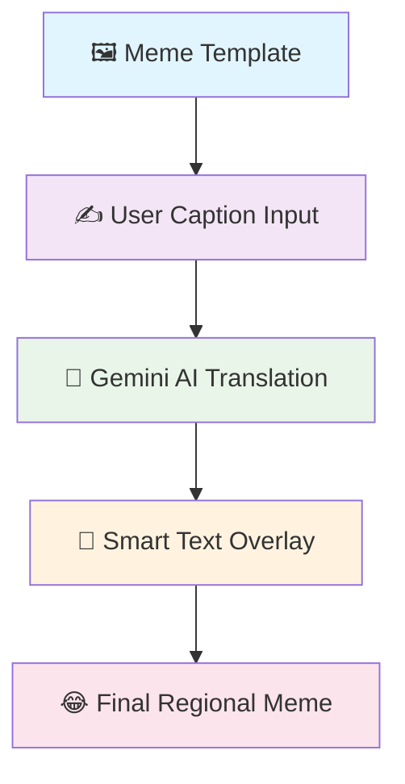

# 🧠 Meme Karigar

**Meme Karigar** is an AI-powered local-language meme generator that brings humor to regional languages. Transform your English or Hinglish captions into native languages like Telugu, Hindi, Tamil, and more, with intelligent text overlay on meme templates.

[](https://github.com/IqbalHere/Meme-Karigar/stargazers)
[](https://github.com/IqbalHere/Meme-Karigar/network)
[](https://opensource.org/licenses/MIT)

---

## 📸 How It Works



## 🚀 Features

- ✅ **Smart Translation**: Powered by Google Gemini AI for accurate regional language translation
- ✅ **Dynamic Text Overlay**: Intelligent text positioning and formatting on meme templates
- ✅ **Multi-Language Support**: Hindi, Telugu, Tamil, Kannada, Bengali, Malayalam, and more
- ✅ **CLI Interface**: Simple command-line tool for quick meme generation
- ✅ **Offline Ready**: Save memes locally with metadata
- 🔜 **Coming Soon**: Voice narration, web interface, and meme API integration

## 📂 Project Structure

```
meme-karigar/
│
├── 📁 assets/
│   └── 📁 meme_templates/     # Meme image templates
│
├── 📁 translated_memes/       # Generated memes with captions
│
├── 🐍 translator.py           # Gemini-powered translation engine
├── 🎨 caption_maker.py        # Text overlay and formatting
├── ⚡ main.py                 # Main application entry point
├── 📋 requirements.txt        # Python dependencies
└── 📖 README.md              # Project documentation
```

## 🧠 Requirements

- **Python 3.10+**
- **PIL (Pillow)** for image processing
- **Google Gemini API** access
- **Internet connection** for translation (initial setup)

## 🔧 Installation

### 1. Clone the Repository
```bash
git clone https://github.com/IqbalHere/Meme-Karigar.git
cd Meme-Karigar
```

### 2. Create Virtual Environment
```bash
# Windows
python -m venv venv
venv\Scripts\activate

# macOS/Linux
python -m venv venv
source venv/bin/activate
```

### 3. Install Dependencies
```bash
pip install -r requirements.txt
```

### 4. Setup Gemini API
1. Get your Gemini API key from [Google AI Studio](https://makersuite.google.com/app/apikey)
2. Set environment variable:
   ```bash
   # Windows
   set GEMINI_API_KEY=your_api_key_here
   
   # macOS/Linux
   export GEMINI_API_KEY=your_api_key_here
   ```

## 🛠️ Usage

### Quick Start
1. **Add meme templates** to the `assets/meme_templates/` directory
2. **Run the application**:
   ```bash
   python main.py
   ```
3. **Follow the prompts**:
   ```
   🎭 Welcome to Meme Karigar!
   
   📝 Enter your meme caption: when monday hits hard
   🌍 Choose target language (hi/te/ta/kn/bn/ml): te
   
   🤖 Translating... 
   ✅ Translation: సోమవారం గట్టిగా తాకినప్పుడు
   🎨 Creating meme...
   ✅ Meme saved to: translated_memes/monday_meme_te.jpg
   ```

### Example Output
Your generated meme will be saved in the `translated_memes/` folder with proper formatting and regional text overlay.
## 🗣️ Supported Languages

| Language | Code | Example |
|----------|------|---------|
| 🇮🇳 Hindi | `hi` | हैलो दुनिया |
| 🏛️ Telugu | `te` | హలో ప్రపంచం |
| 🎭 Tamil | `ta` | வணக்கம் உலகம் |
| 🎵 Kannada | `kn` | ಹಲೋ ವರ್ಲ್ಡ್ |
| 📚 Bengali | `bn` | হ্যালো বিশ্ব |
| 🌴 Malayalam | `ml` | ഹലോ വേൾഡ് |
| 🦚 Gujarati | `gu` | હેલો વર્લ્ડ |
| 🏔️ Marathi | `mr` | हॅलो वर्ल्ड |

*More languages coming soon!*

## 📌 Roadmap

- [x] **v1.0**: Basic CLI with translation and overlay
- [ ] **v1.1**: Text-to-Speech integration
- [ ] **v1.2**: Web UI with modern framework
- [ ] **v1.3**: Meme API integration (random templates)
- [ ] **v1.4**: User accounts and meme sharing
- [ ] **v1.5**: Mobile app support

## 🤝 Contributing

We welcome contributions! Here's how you can help:

1. 🍴 Fork the repository
2. 🔧 Create a feature branch: `git checkout -b feature-name`
3. 💻 Make your changes and commit: `git commit -m 'Add feature'`
4. 📤 Push to the branch: `git push origin feature-name`
5. 🔄 Submit a pull request

### Development Setup
```bash
# Install development dependencies
pip install -r requirements-dev.txt

# Run tests
python -m pytest tests/

# Format code
black . && isort .
```

## 🐛 Issues & Support

- 🐛 **Bug Reports**: [Create an issue](https://github.com/IqbalHere/Meme-Karigar/issues)
- 💡 **Feature Requests**: [Start a discussion](https://github.com/IqbalHere/Meme-Karigar/discussions)
- 📧 **Contact**: [hussain@example.com](mailto:hussain@example.com)

## 🤖 Credits


### Powered By:
- 🧠 **Google Gemini AI** - Intelligent translation
- 🎨 **Pillow (PIL)** - Image processing
- 🐍 **Python** - Core development

> *"Making memes regional, emotional, and universally fun!"*

## 📜 License

This project is licensed under the MIT License - see the [LICENSE](LICENSE) file for details.

---

<div align="center">
  
**⭐ Star this repo if you found it helpful!**

[🏠 Home](https://github.com/IqbalHere/Meme-Karigar) • [🐛 Issues](https://github.com/IqbalHere/Meme-Karigar/issues) • [🔄 Pull Requests](https://github.com/IqbalHere/Meme-Karigar/pulls) • [💬 Discussions](https://github.com/IqbalHere/Meme-Karigar/discussions)

</div>
